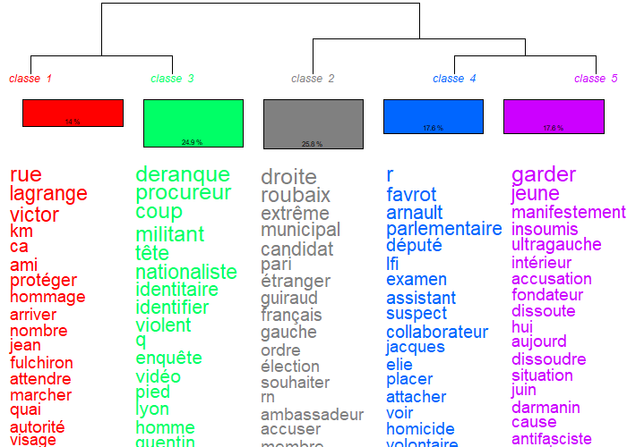
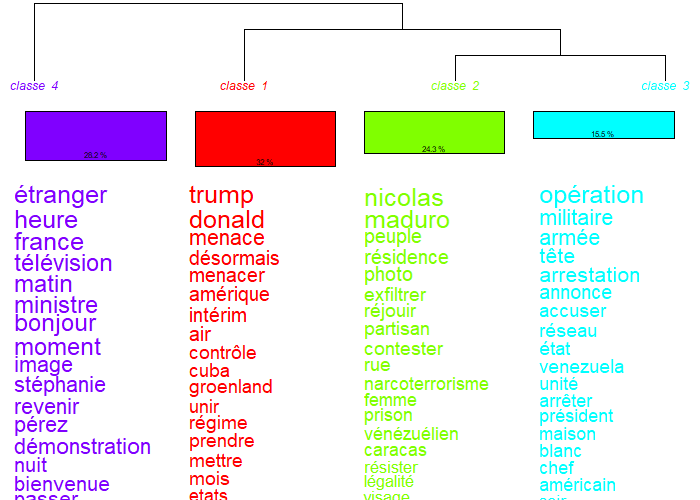

\addtocontents{toc}{\protect\setcounter{tocdepth}{2}}
\newpage

# La narration et la critique constituent deux fonctions journalistiques opposées qui orientent pré-réflexivement l'usage des outils rhétoriques dont la légitimité s’adosse à une définition de la neutralité

------------------------------------------------------------------------

## Le média dominant privilégie une rationalité narrative dont l’objectif est de rendre l’actualité fluide et institutionnellement crédible.

### Analyse des dendrogrammes

Dans le chapitre précédent, nous avons établi quantitativement, et grâce à de nombreux d'indicateurs lexicaux, l'existence empirique d'une rationalité narrative chez le média dominant. Désormais, nous cherchons à la comprendre qualitativement. Autrement dit, nous recherchons dans la pratique des agents des éléments de compréhension et d'explication de l'existence d'une telle rationalité. Pour mener à bien ce travail, nous mobilisons deux nouveaux matériaux. Le premier conciste en une analyse de la structure thématique du corpus par classification hiérarchique descendante (CHD). Cette analyse permet de cartographier les univers lexicaux mobilisés par chaque média sur un même sujet. Par ailleurs, son fonctionnement détaillé est expliqué dans l'encadré \ref{meth:CHD}. Le second est composé des entretiens semi-directifs avec des journalistes des deux pôles (dominants et alternatifs). Evidement, à travers ces entretiens semi-directif, il ne s'agit pas de généraliser la parole d'un journaliste à l'ensemble de sa profession. Il s'agit plutôt de donner à voir par l'incarnation, les logiques que les indicateurs quantitatifs ne peuvent détecter. Aussi, pour ce sous-chapitre, l'entretien mobilisé est celui d'une journaliste web de France 3 Auvergne, sortie en 2024 de l'École de journalisme et de communication d'Aix-Marseille. Bien que France 3 ne fasse pas partie de notre corpus, son appartenance au même groupe, France Télévisions, et donc au service public en fait une illustration sociologique pertinente.

Si la rationalité narrative existe statistiquement chez le média dominant, encore faut-il en saisir son incarnation pratique. Précédement, nous avons mesuré la présence d'indicateurs narratifs mais nous n'avons pas pu analyser comment cette narrativité structure le contenu produit lui même. En analysant le contenu lexical, nous voulons comprendre l'architecture narrative mise en place pour mieux l'analyser. Alors, comme évoqué dans le préambule du chapitre, nous allons utilisé la méthode Reinert qui nous permettra d'obtenir les dendogrammes \ref{fig:dendrogramme-jt-deranque} et \ref{fig:dendrogramme-jt-vene}, denddrogrammes respectivement liés au sous-corpus de l'affaire Deranque et du Vénézuela. Ici, s'intéresser au dendrogramme sur le corpus complet perd de son intérêt car les thématiques étant nombreuses sur deux mois de vidéos, empêche l'émergence de classes lexicales précises car ajoute trop de bruit statistique.

::: {.methodo data-latex="{Méthode Reinert et classification hiérarchique descendante (CHD)}"}
\label{meth:CHD} La classification hiérarchique descendante (CHD), aussi nommée méthode Reinert, est une méthode lexicométrique. Elle conciste en le regroupement de segments d'un corpus selon leurs proximités lexicales. En effet, chaque transcription est découpée en segments de même taille. Ensuite, un tableau croisé est construit entre ces segments et les mots qu'ils contiennent. Après cela, par divisions successives, l'algorithme scinde de manière itérative le corpus en deux sous-classes jusqu'à obtenir un nombre de classes interprétables. Finalement, chaque classe terminale rassemble les segments lexicalement les plus proches entre eux et les plus distants des autres classes. Concrètement, cela revient à identifier les thèmes qui structurent un corpus sans imposer a priori de catégories d'analyse comme nous avions pu le faire précédement pour des raisons techniques.

Nous avons appliqué cette méthode par sujet et par média grâce au logiciel IRaMuTeQ.[@zotero-item-219]$^,$ [@zotero-item-220]
:::

```{r dendrogramme-jt-deranque, fig.cap="Classes lexicales de France 2 sur l'affaire Deranque (CHD, 5 classes)"}

```


La figure \ref{fig:dendrogramme-jt-deranque} fait apparaître cinq classes pour le traitement de l'affaire Deranque par France 2. Aucune de ces classes ne correspond à un univers conceptuel ou interprétatif. En effet, elles relèvent toutes sont de descriptions de scènes et de personnages. La classe 1 (14 %) regroupe les éléments du récit local de l'événement et de son hommage : *rue, lagrange, victor, ami, protéger, hommage, arriver, nombre*. La classe 3 (24,9 %) cadre l'affaire dans son aspect judiciaire et centré sur les institutions : *deranque, procureur, coup, militant, tête, nationaliste, identitaire, identifier*. La classe 2 (25,8 %) fait émerger un thème politique *droite, roubaix, extrême, municipal, candidat*, lié à l'impact sur l'actualité, donc les municipales 2026, de cet événement. La classe 4 (17,6 %) est le second volet judiciaire qui est, lui, centré sur les suspects : *favrot, arnault, parlementaire, député, lfi, examen, assistant, suspect, collaborateur*. Finalement la classe 5 (17,6 %) regroupe les éléments lexicaux liés à la dissolution passée de la Jeune Garde, association antifaciste, liée à cette actualité par les acteurs du récit : *garder, jeune, manifestement, insoumis, ultragauche, intérieur*. Notons, la présence dans les classes 3 et 4 par exemple des lettres “*q*” et “*r*” seuls et qui pourrait soulever des interrogations. Elles sont simplement le résultat de la logique de co-occurence de l'algorithme. En effet, le “*Q.*” étant toujours proche de “*Deranque*” dans “*Q. Deranque*”, l'alogorithme l'associe à la même classe lexicale. 

Ainsi, ce dendrogramme permet de mettre en lumière qu'aucune des classes lexicales identifiées ne mobilisent ni un registre conceptuel abstrait, ni un registre analytique qu'il soit méta-discursif (une réflexion sur les conditions du traitement de l'information ou sur le débat public par exemple) ou non. En effet, nos résultats montrent que toutes les classes s'organisent autour de noms propres, de lieux ou d'actions. En réalité, le JT de France 2 s'organise autour d'une juxtaposition de scènes qui permettent de construire le récit de l'affaire.  

Aussi, afin de compléter ce nouveau résultat, intéressons au sous-corpus lié au Vénézuela.

```{r dendrogramme-jt-vene, fig.cap="Classes lexicales de France 2 sur la séquence vénézuélienne (CHD, 4 classes)"}

```

Le dendrogramme lié à la séquence vénézuélienne (figure \ref{fig:dendrogramme-jt-vene}) confirme notre conclusion précédente. 
D'abord, étudions les différentes classes dégagées par la CHD. La classe 4 (28,2 %) ne porte aucun contenu informationnel sur le Venezuela, mais regroupe seulement les marqueurs lié au rituel de commencement du JT : *étranger, heure, france, télévision, matin, ministre, bonjour, moment, image* (expliquée par un corpus plus succint que celui sur l'affaire Deranque). Ensuite, la classe 1 (32 %) s'articule autour de Trump : *trump, donald, menace, désormais, menacer, amérique, intérim*). Puis la classe 2 (24.3%) liée au récit des événements dans le Vénézuela : *nicolas, maduro, peuple, résidence, photo, exfiltrer, réjouir*). Et finalement, la classe 3 (15,5 %) évoquant l'aspect militaire de l'opération : *opération, militaire, armée, tête, arrestation, annonce, accuser*). Alors, une fois encore, aucune classe ne vient organiser le contenu autour d'un cadre interprétatif. Ces classes racontent des moments, des lieux ou des acteurs du récit.

Ainsi, les deux dendrogrammes \ref{fig:dendrogramme-jt-deranque} et \ref{fig:dendrogramme-jt-vene} confirme ce que nos indicateurs lexicaux nous laissaient entrevoir. Le traitement de l'information par le média dominant est structurellement narratif. Dès lors, la fonction qu'il s'attribue n'est pas de proposer une grille de lecture du monde mais d'en restituer le déroulement. 

### Analyse des entretiens

Enfin, pour comprendre pourquoi le contenu se présente sous cette forme, l'entretien avec la journaliste de France 3 est important car permet de dégager une réponse : la narration n'est pas un choix éditorial, elle compose le squellette de la chaîne quotidienne de production de l'information.  
Ainsi, interrogée sur sa journée type, l'enquêtée décrit une succession ritualisée d'étapes :

> *« Eh bien, ça commence par une conférence de rédaction. Tous les matins à 9h, tous les journalistes, les rédacteurs en chef, les documentalistes, bref, toute l'équipe qui a un rôle à jouer de près ou de loin dans les éditos, se réunissent chaque matin pour établir un plan de route, on va dire, de la journée. »*

Puis :

> *« Donc c'est plutôt le rédacteur en chef, qui est un peu le chef d'orchestre de tout ça, qui attribue à chacun un sujet, une piste en particulier à creuser. »*

Et enfin :

> *« À l'issue donc de cette conférence de rédaction, chacun prend un sujet dont il a été confié, [\dots] à partir du matin, on fait ce qu'on appelle du calage. Donc on appelle nos sources, on essaie de creuser le sujet, de caler les interviews, on réalise nos interviews, etc. [\dots] on passe donc à la rédaction [\dots] et ensuite il y a une phase de relecture avec notre rédacteur en chef. »*

La séquence quotidienne que décrit la journaliste peut se résumer ainsi : conférence $\rightarrow$ attribution $\rightarrow$ calage $\rightarrow$ interview $\rightarrow$ rédaction $\rightarrow$ relecture. Ce protocole structure la production du média. Alors, cette description révèle l'abscence de place laissée à l'élaboration d'un cadre interprétatif. En effet, le journaliste reçoit un sujet, contacte ses sources, conduit ses interviews, restitue. Le format imposé par la chaîne de production est celui du compte-rendu d'enquête courte, format protocolaire lui donnant une crédibilité institutionnelle. Autrement dit, le journal impose un récit factuel structuré. Alors, la rationalité narrative est l'effet mécanique de cette organisation du travail. Comme le contenu du JT est produit sous la forme d'enquêtes courtes, celui-ci prend la forme d'une succession de scènes. La rationalité narrative est l'artefact textuel d'une chaîne de production formatée découlant d'un protocole quotidien intériorisé et institué, de fait, en norme.

Aussi, cette absence de construction de cadre interprétatif est d'autant plus tenace qu'elle est intériorisée avant l'entrée en poste. En effet, interrogée sur ses attentes d'étudiante en école de journalisme, l'enquêtée déclare :

> *« Lorsqu'on rentre dans les écoles de journalisme, on nous met tout de suite face aux réalités du métier, donc face à la précarisation, face aux contraintes liées au métier, aux contraintes techniques [\dots]. Donc ce qui fait que, forcément, lorsqu'on est dans ce cursus, on n'a plus vraiment d'attente, en tout cas d'attente éloignée de la réalité. »*

Et plus loin :

> *« Mes attentes étaient de pouvoir faire un peu plus d'investigation et de travail de fond, enfin de travail sur du temps long, et on m'a tout de suite expliqué que c'est vraiment une infime minorité de journalistes qui peuvent avoir le luxe que de travailler ainsi. »*

Deux analyses peuvent être dégagées de ce témoignage. D'une part, l'école de journalisme prépare ses étudiants à la chaîne de production rapide qui sera leur quotidien. En effet, la précarité, la contrainte de format et l'absence de temps long sont posées comme un horizon qui, a priori, ne peut être que subit. D'autre part, l'envie de travailler dans l'investigation, c'est-à-dire dans un travail qui pourrait ouvrir un espace réflexif, est explicitement renvoyée à l'exception, à un « luxe » réservé à une minorité. Alors, la rationalité narrative est normalisée dès la formation. Non seulement comme la forme dominante du métier, mais comme la seule forme réaliste. Les contraintes économiques et de format que nous retrouverons en 3.2 sont ici déjà existantes et évoquées, sous la forme d'une socialisation anticipée qui dispense de questionner le format dont on hérite.

Enfin, cette intériorisation s'accompagne d'une définition fonctionnelle du specatteur. Interrogée sur la manière dont elle s'adresse à ses lecteurs, l'enquêtée répond :

> *« On essaie de leur amener l'information de la manière la plus simple possible, enfin simple à comprendre, enfin simple à intégrer. »*

Cette formule semble résumé un mode de pensée, une vision du métier des médias dominants : *la simplicité*. Non pas dans un sens d'apprauvrissement du réel mais plutôt dans celui de rentre l'information intégrable. Autrement dit, l'objectif est de restituer l'information d'une façon qui ne demande pas au destinataire de reconstruire un cadre analytique ou interprétatif. Ainsi, les classes lexicales, dont les dendrogrammes ont permis l'émergence, ne s'organisent pas autour d'univers conceptuels parce que la fonction du contenu est précisément d'éviter au destinataire ce travail de conceptualisation. Dès lors, l'objectif du récit est de fluidifier l'intégration de l'information et d'éviter toute coupure interprétative.

Finalement, on observe donc trois moments dinstincts : la chaîne de production impose la forme récit, la socialisation scolaire naturalise cette forme, la définition du destinataire en valide la fonction. Alors, la rationalité narrative que les indicateurs du chapitre 1 ont mesurée et que les dendrogrammes que nous venons d'examiner cartographient est l'état stable d'une méthode de production institutionalisée dans laquelle chaque étape, de la formation à l'écriture du sujet, renforce la précédente. Dès lors, le journaliste dominant n'a pas à choisir le récit parce que, précisémment, il en hérite, il l'exécute et, de fait, il le transmet.
Alors, face à cette rationalité narrative rendant l'actualtié fluide et institutionnellement crédible, les médias alternatives, eux, déploient une rationalité critique dont nous allons étudier les effets dans la sous-partie suivante.
