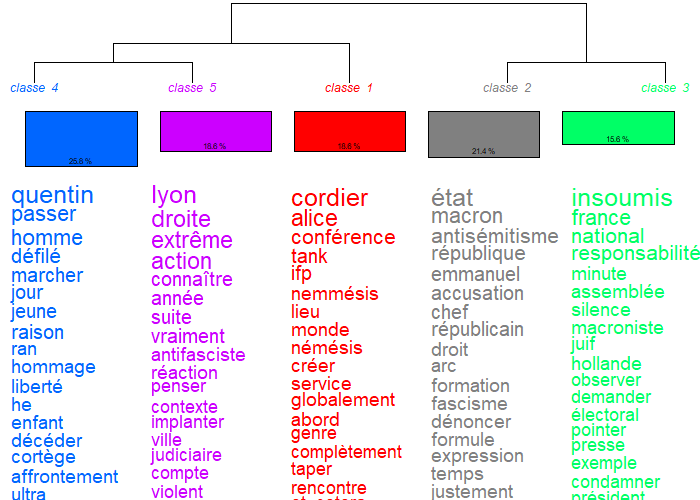
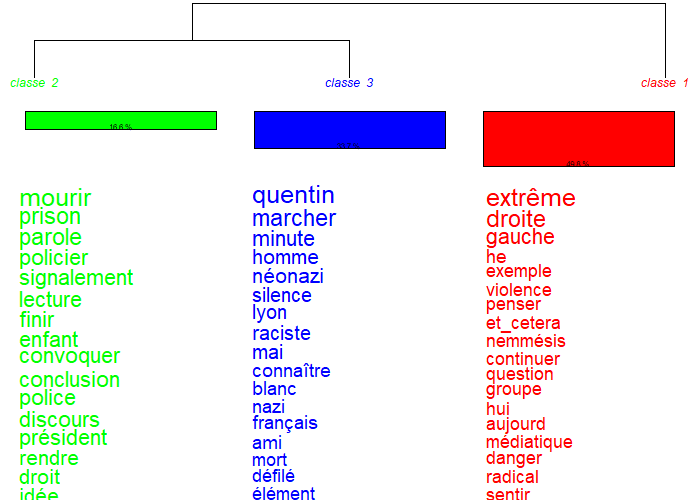
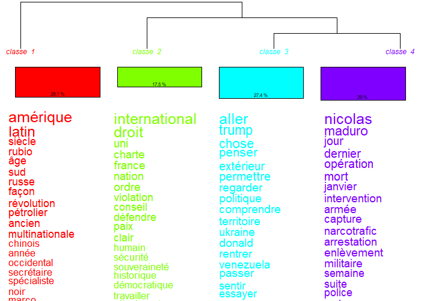
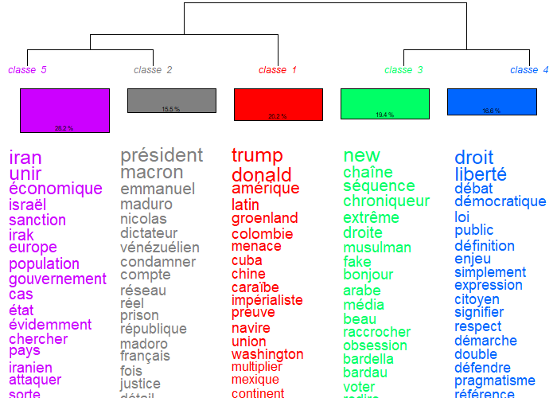

\addtocontents{toc}{\protect\setcounter{tocdepth}{2}}

## Les médias alternatifs déploient une rationalité critique qui transforme la rigueur factuelle en instrument de déconstruction du récit dominant.


Nous avons démontré dans le sous-chapitre précédent que la rationalité narrative du média dominant n'est pas issue d'une délibération éditoriale mais est l'effet immanent d'une chaîne de production de l'information. Alors, de façon symétrique, nous cherchons désormais à comprendre comment la rationalité critique des médias alternatifs, que nous avions caractérisée quantitativement en [1.3](#1-3), s'incarne dans la pratique des agents. Dans cette perspective, nous mobilisons comme précédemment des dendrogrammes et des extraits d'entretiens semi-directifs. Parmi ceux-là, on retrouve d'abord, quatre dendrogrammes issus de la CHD (\ref{meth:CHD}) appliquée à Blast et à *Le Média* sur les sous-corpus de l'affaire Deranque et du Vénézuela. Ensuite, nous mobilisons deux entretiens semi-directifs. Le premier est celui d'un pigiste de Blast, ancien étudiant à l'École des métiers de l'information et le second est celui d'une journaliste freelance ayant collaboré avec de nombreux médias dominants et alternatifs (AFP, Arte, Mediapart, Le Monde). Cette dernière, bien qu'elle ne travaille pas directement pour les médias de notre corpus, s'inscrit dans notre définition de l'« indépendance » notamment par son statut lui-même ou ses quelques mois à Mediapart. Comme pour la journaliste de France 3 dans le sous-chapitre précédent, nous la considérons comme une illustration sociologique pertinente du pôle alternatif cette fois.

### L'analyse des classes lexicales des médias alternatifs démontre l'utilisation de cadres interprétatifs ayant pour objet le récit dominant.

D'abord, pour saisir l'incarnation pratique de la rationalité critique, nous devons examiner la structure thématique du discours alternatif. Ensuite nous nous intéresserons aux conditions de production qui rendent cette structure possible. Notons qu'à l'instar de la démarche suivie en 2.1, nous écartons le corpus complet, dont le bruit statistique empêche l'émergence de classes thématiques interprétables.

```{r dendrogramme-blast-deranque, fig.cap="Classes lexicales Blast (gauche) et Le Média (droite) - Deranque", out.width="48%", fig.show="hold", fig.align="default"}


```

Les dendrogrammes de la figure \ref{fig:dendrogramme-blast-deranque} font apparaître des classes lexicales et une structure différentes de celles observées pour France 2. Ainsi, pour Blast une seule classe sur 5 (la classe 4, 25,8 %) relève d'un registre seulement descriptif et est celle de la chronologie du défilé d'hommage : *quentin, défilé, marcher, hommage, décéder, affrontement*. Contrairement à cette première classe, les quatre autres mobilisent des registres interprétatifs. La classe 5 (18,8 %) construit un cadrage politique de la séquence en détaillant l'histoire des conflits extrême droite / extrême gauche à Lyon : *droite, extrême, antifasciste, année, contexte, penser, judiciaire, implanter, violent*. Quant à elle, la classe 1 (18,6 %) analyse le dispositif idéologique du collectif Nemesis : *cordier, alice, conférence, tank, némésis, créer*. La classe 2 (21,4 %) articule un registre méta-discursif sur l'antisémitisme et le fascisme dans le débat public : *macron, antisémitisme, république, fascisme, dénoncer, formule, expression*. Enfin, la classe 3 (15,6 %) mobilise un registre de mise en cause politique des responsabilités : *insoumis, responsabilité, macroniste, hollande, condamner, électoral*. Alors, toutes ces classes, comme le sous-chapitre 1.3 nous l'indiquait, mobilisent souvent des acteurs du récit. Cependant, cela n'est pas dans un but purement narratif car juxtaposés à des concepts abstraits (*macron* (un acteur) dans une classe lexicale contenant *antisémitisme* ou *arc républicain* par exemple). *Le Média*, lui, présente une structure plus condensée, en trois classes seulement, mais dont la classe 1 (48 %) est méta-médiatique et politique : *extrême, droite, gauche, violence, médiatique, danger, radical*. Ainsi, là où France 2 juxtaposait des scènes, Blast et *Le Média* mettent en place des opérations critiques. Ils qualifient (*antifasciste*, *néonazi*, *raciste*), contextualisent (*collectif*, *Nemesis*), et mènent des (méta-)analyses en mobilisant des objets conceptuels (*médiatique*, *danger*, *radical*, *antisémitisme*, *fascisme*) ; “méta” dans le sens “à propos de”, un discours analysant un discours, un média analysant un média.

```{r dendrogramme-blast-vene, fig.cap="Classes lexicales Blast (gauche) et Le Média (droite) - Vénézuela", out.width="48%", fig.show="hold", fig.align="default"}


```

De plus, le sous-corpus vénézuélien (figure \ref{fig:dendrogramme-blast-vene}) confirme le résultat juste évoqué. D'abord, chez Blast, sur les quatre classes dégagées, une seule (la classe 4, 29 %) relève du récit événementiel : *nicolas, maduro, jour, dernier, opération, mort, janvier, intervention*. En revanche, les trois autres classes construisent, elles, des cadres conceptuels : un cadre géopolitique-historique (*amérique, latin, siècle, rubio, âge, révolution, occidental*), un cadre normatif issu du droit international (*international, droit, charte, violation, conseil, paix, souveraineté, démocratique*), et un registre méta-discursif d'analyse politique (*trump, comprendre, penser, politique, territoire*). Ensuite, *Le Média* va plus loin, avec la classe 5 (28,2 %) notamment, qui construit un cadre comparatiste de l'impérialisme en évoquant des conflits passés : *iran, israël, sanction, irak, population, gouvernement, attaquer*. La classe 1 (20,2 %) qualifie l'opération comme géopolitiquement impérialiste : *trump, donald, amérique, latin, groenland, colombie, menace, cuba, impérialiste*. Quant à elle, la classe 3 (19,4 %) est explicitement méta-médiatique : *chaîne, séquence, chroniqueur, fake, média, raccrocher, obsession, bardella*. Enfin, la classe 4 (16,6 %) mobilise un registre normatif et théorique : *droit, liberté, débat, démocratique, citoyen, signifier, expression*.

Ainsi, ces quatre dendrogrammes confirment ce que les indicateurs du chapitre 1 laissaient pressentir. La rationalité critique ne se réduit pas à un déficit de récit, elle ajoute un travail de mise en perspective. Trois opérations discursives la caractérisent. D'abord, *qualifier* (un acteur, un dispositif, un événement). Ensuite, *contextualiser* (par le droit international, par la comparaison historique, par le cadre géopolitique). Enfin, le *méta-discursif* (sur les médias eux-mêmes, sur le champ politique). Aussi, un point important est que ces classes critiques ne s'opposent pas aux faits, elles s'y attachent car ils sont les fondements de l'analyse critique. Alors, comme nous avons pu le voir, les noms propres, les institutions, les dates ou les chiffres y sont présents. Par ailleurs, cela éclaire le résultat du chapitre 1.3 où les médias alternatifs mobilisaient plus de personnes que France 2. En somme, la rigueur factuelle n'est pas l'opposé de la critique, elle en est la condition.

Or, ces trois opérations ne flottent pas dans l'abstrait, elles s'exercent contre le récit dominant analysé en 2.1. Qualifier *Nemesis* comme dispositif idéologique, c'est défaire le cadre événementiel du « défilé d'hommage » que France 2 mobilisait. Contextualiser l'intervention vénézuélienne par le *droit international*, la *charte*, la *souveraineté*, c'est démanteler la séquence géopolitique fluide dans laquelle le média dominant inscrivait l'opération. Mais c'est surtout la classe méta-médiatique du *Média* (*chaîne, séquence, chroniqueur, fake, obsession, bardella*) qui explicite ce travail en prenant pour objet le discours médiatique lui-même, et donc le récit dominant en tant que récit. Ainsi, la rationalité critique ne se contente pas de coexister avec la rationalité narrative, elle l'analyse, la nomme et la met à distance. Alors, c'est en s'attachant aux mêmes faits, Quentin Deranque, le défilé d'hommage, l'opération étatsunienne au Vénézuela, que les médias alternatifs peuvent en retourner le cadrage. En réalité, le fait devient le levier de déconstruction du récit dominant. De plus, nous pouvons ajouter que ces opérations relèvent du courant contre-hégémonique tel que défini par Cardon et Granjon[@cardonMediactivistes]. En effet, celles-ci visent à déconstruire le récit dominant et à proposer un cadrage alternatif, d'où la forte présence d'opérations méta-médiatiques chez *Le Média*. 

Néanmoins, cette structure textuelle ne s'explique pas que par les dispositions du discours. En effet, comme en 2.1, c'est dans la pratique des agents qu'il faut en chercher les conditions d'émergence. 

### La conflictualisation éditoriale et la rigueur factuelle placent la critique en méthode professionnelle plutôt qu'en posture militante.

Pour rappel, les entretiens mobilisés sont celui d'un pigiste de Blast et d'une journaliste freelance (donc elle-même indépendante) ayant travaillé pour de nombreux médias, dont des médias alternatifs.

D'abord, le premier élément qui ressort des deux entretiens est la revendication explicite de l'angle d'approche des sujets comme étant un acte journalistique à part entière. Le pigiste de Blast déclare ainsi :

> *« Forcément, tout le monde a ses convictions, tout le monde peut avoir des biais, donc même dans le choix des sujets, quand on choisit un sujet, c'est forcément qu'on veut le traiter sous un certain angle. »*

Mais l'angle assumé n'empêche pas de s'appuyer sur les faits, qui sont nécessaires à un raisonnement rigoureux. L'enquêté décrit le contradictoire comme un préalable obligé du papier, y compris pour les sujets dont l'angle est pourtant assumé :

> *« Pour le contradictoire, il faut demander aux personnes dont on parle, [\dots] il faut qu'on les contacte. »*

Cette exigence de rigueur peut être retrouvée chez la journaliste freelance à travers le recoupement systématique :

> *« Ce que je mets en valeur dans mon travail, c'est de vérifier tout ce que j'écris, les sources, d'être sûre avant d'écrire une information [\dots]. Il y a des choses que j'ai pas mises dans certains articles parce que je n'avais pas recoupé, à mon goût, assez de sources. »*

Alors, ces deux extraits donnent à voir une définition du travail journalistique. Là où la journaliste de France 3 décrivait un protocole intériorisé sans proposer de réflexion sur les sources elles-mêmes, les enquêtés du pôle alternatif évoquent par eux-mêmes le contradictoire, la vérification et le recoupement. Ici, la rigueur factuelle n'est pas une norme passive mais une exigence active, qui oblige à contacter avant d'écrire, à filtrer, à ne pas publier si l'on n'a pas recoupé. Cette activité de filtrage est en elle-même une dimension critique du travail alors, exiger une vérification supplémentaire, contacter pour le contradictoire, choisir de retirer un passage faute de sources sont des opérations qui transforment la rigueur en méthode de construction du fait et non en un simple enregistrement de ce qui est dit. Sur les mêmes événements que ceux traités par France 2 (l'hommage à Quentin Deranque, l'opération étatsunienne au Vénézuela) c'est ce filtrage actif qui permet aux médias alternatifs de retourner le cadrage, par exemple : qualifier *Nemesis* comme dispositif idéologique ou mobiliser le droit international comme cadre d'analyse n'est possible qu'au prix d'un travail documentaire sur les acteurs, les chronologies, les textes juridiques. La rigueur et le travail du fait ne sont donc pas opposés à la critique, ils en sont l'opération constitutive.

Cette construction critique du fait ne tient cependant pas qu'à des dispositions individuelles. Elle est rendue possible, comme en 2.1 mais en sens inverse, par les conditions concrètes de production. Le pigiste de Blast décrit un fonctionnement où le sujet n'est pas attribué dans une logique de calage rapide mais discuté avant validation :

> *« Soit c'est moi qui ai une idée particulière, et je pense que ça pourrait faire le sujet d'un article, donc je soumets ça à [la rédaction], après ils valident ou ils valident pas, sinon eux aussi peuvent me proposer des sujets. »*

La journaliste freelance fait part de son expérience à Mediapart et évoque ce phénomène de façon plus nette encore :

> *« Quand je travaillais à Mediapart, j'ai l'impression qu'on a énormément de débats éditoriaux, ce qui est assez rare, finalement, malheureusement, dans la plupart des rédactions. »*

En effet, le débat éditorial et la validation argumentée constituent l'inverse exact du processus décrit en 2.1 (conférence ritualisée et attribution descendante). Ce n'est pas seulement que les alternatifs pensent autrement : ils disposent d'un temps et d'un espace de production qui rendent la conceptualisation possible car cet espace est lui-même un lieu de conflictualisation, d'échange et de débat. Dès lors, les classes lexicales conceptuelles, juridiques et méta-médiatiques que les dendrogrammes ont fait émerger trouvent leur explication pratique. Elles sont l'effet textuel de conditions de production qui autorisent, voire exigent l'élaboration d'un cadre interprétatif.

Alors, ces deux moments que nous venons d'étudier convergent vers la définition empirique de la rationalité critique annoncée par 1.3. Cette rationalité ne consiste pas à substituer l'opinion au fait, mais à placer le fait dans un cadre conceptuel qui discute ce que la fluidité narrative normalise. Aussi, c'est précisément en cela qu'elle déconstruit le récit dominant. Pour ce faire, elle ne lui oppose pas un contre-récit mais exhibe les opérations de cadrage et les effets de naturalisation que la rationalité narrative analysée en 2.1 ne pouvait rendre visibles car composant interne d'un processus intériorisé donc pré-réflexif. La rigueur factuelle, partagée par les deux pôles, occupe dès lors deux fonctions opposées. Elle est protocole de crédibilité institutionnelle chez le média dominant, et instrument de déconstruction chez les alternatifs.

Cette divergence fonctionnelle dans le rapport au fait nous mène à la question suivante. Si les deux pôles mobilisent la rigueur factuelle pour des fins opposées, comment chacun se réclame-t-il pourtant de ce que l'un appelle « neutralité » ou l'autre « objectivité » ?  Cette divergence dans la définition de la neutralité, et la fonction de légitimation qu'elle remplit dans chaque pôle, fait l'objet du sous-chapitre suivant.
